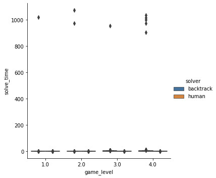
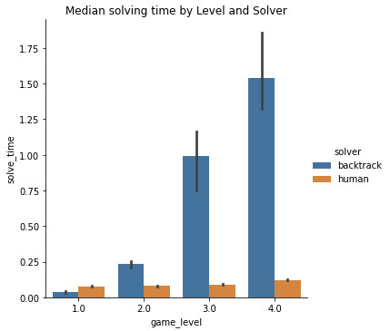
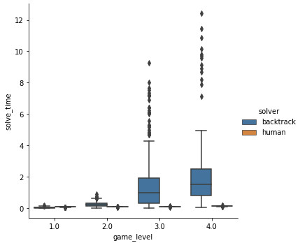

This is a Sudoku solving program (or Sudoku AI to be fancy) that I wrote from scratch to practice data manipulation using numpy as well as testing different Sudoku algorithms.

Table of content:

- [A. Solvers](#a-solvers)
  - [Bactrack solver](#bactrack-solver)
  - [Human tactic](#human-tactic)
- [B. Performance comparison](#b-performance-comparison)
  
# A. Solvers
## Bactrack solver

Backtrack solver use an algorithm that incrementally tries different values for each cells and then backtracking (abandons a candidate) if there was conflict. Backtrack solver has the worst case complexity and average case complexity of $O(9^n)$ where $n$ is the number of blank cells $(1 \leq n \leq 81)$.

## Human tactic

Human tactic solver try to mimic a popular human tactic: 
- Scanning the board to eliminate possible values for each cell
- Write down the concrete solution for a cell if there is only 1 possibility
- Using the updated information to further eliminate possibilities for other cells

Although this is a human tactic, computer has the advantage over human in two regards: Super fast logical operation to do exhaustive search, large memory to store the possibility table.

Human tactic solver has the time complexity of $O(9^2 \times n \times iter) = O(n \times iter)$ where $iter$ is the number of iteration it takes to complete the board. Experiments on 1252 puzzles of all difficulty levels indicates that with each iteration, at least 1 concrete solution would be written down, which means $iter$ is upper-bounded by $n$. If this is correct, worst-case time complexity of the Human tactic would be $O(n^2)$. However, the upper bound assumption remains to be proven mathematically for all legitimate puzzles (i.e. puzzles that have 1 and only 1 answer). The behavior of $iter$ is also unknown in an experimental context where the puzzles are not legitimate.

# B. Performance comparison

Experiment on 1252 puzzles across 4 difficulty levels from the website [https://www.websudoku.com/](https://www.websudoku.com/) (data was crawled using scrapy library), I had some observations on the performance of the 2 algorithms:

1. Backtrack solver has bad worst-case solving time in practice, taking up to 1000 seconds to solve some puzzles across difficulty level. Meanwhile, human tactic doesn't appear to have this problem. <br> 
2. After removing those outliers, backtrack solver has better median solving time compared to human tactic only for difficulty level 1. Human tactic per form much better compare to backtrack solver at level 2 and above, up to 12x faster on average for puzzles level 4. <br> 
3. Even after removing outliers, backtrack solver still has higher variations compared to human solver, both within difficulty level and across difficulty level. <br>  [barplot2](etc/media/analysis_bar_plot2.jpg)

**Replicate the experiment:** Run `entrypoint.py` and analyze the performance log files (`backtrack.parquet` and `human.parquet`)

```py
python entrypoint.py
```
